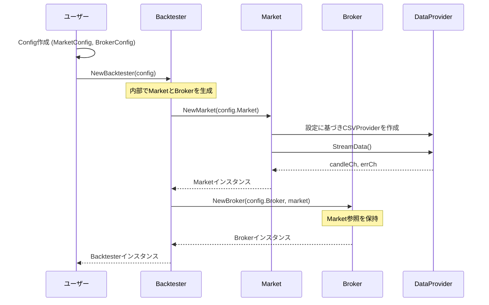
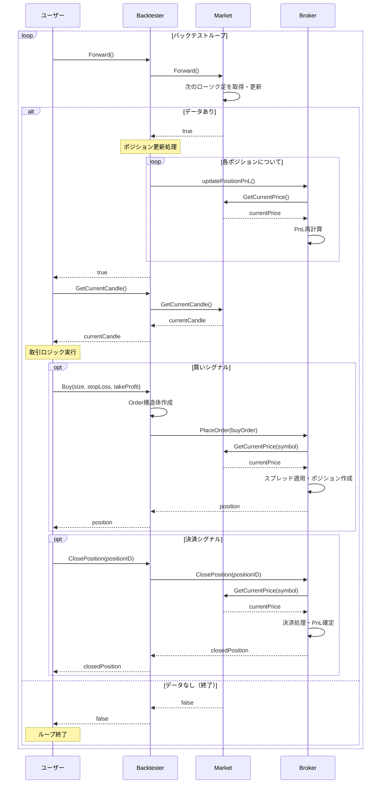
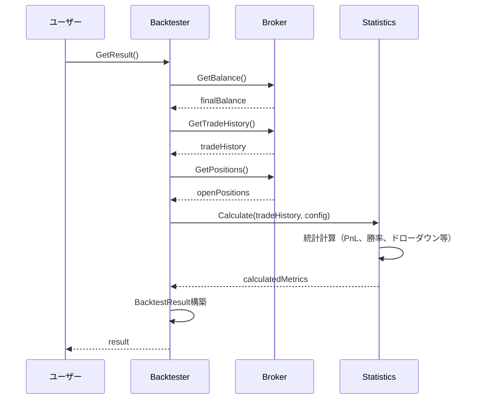

# Backtester 設計書

## 1. 概要

Backtester は、FXバックテストライブラリの中核となるコンポーネントです。バックテストの実行全体を管理し、市場データの取得、ブローカーの操作、状態の更新など、すべての責務を内部にカプセル化します。ユーザーは単純なAPIを通じてバックテストを実行でき、内部の複雑性を意識する必要がありません。

## 2. 責務

- バックテスト全体の統括と制御
- MarketとBrokerの管理と連携
- ユーザー向けAPIの提供（Forward、Buy、Sell等）
- 取引ロジック実行の支援
- バックテスト結果の集計と提供
- エラーハンドリングと状態管理

## 3. ファイル構成

```
pkg/backtester/
├── backtester.go        # Backtesterの実装とユーザーAPI
├── config.go           # Config構造体の定義
├── backtester_test.go  # Backtesterのテスト
└── integration_test.go # 統合テスト
```

## 4. アーキテクチャ

### 4.1 Backtester構造

```go
package backtester

import (
    "fx-backtesting/pkg/market"
    "fx-backtesting/pkg/broker"
    "fx-backtesting/pkg/models"
)

// Backtesterは、市場データアクセス、注文実行、状態管理をすべて内包します。
type Backtester struct {
    config Config
    market market.Market
    broker broker.Broker
    symbol string
}
```

### 4.2 設定構造

```go
type Config struct {
    Market MarketConfig
    Broker BrokerConfig
}

type MarketConfig struct {
    DataProvider DataProviderConfig
    Symbol       string
}

type DataProviderConfig struct {
    FilePath string
    // 将来的にTimeframe、DataSource種別などを追加
}

type BrokerConfig struct {
    InitialBalance float64
    Spread         float64
}
```

### 4.3 ユーザーAPI

```go
// Backtesterの主要API
type BacktesterAPI interface {
    // 時間進行
    Forward() bool
    
    // データアクセス
    GetCurrentCandle() (models.Candle, error)
    GetCurrentPrice(symbol string) (float64, error)
    
    // 取引実行
    Buy(size, stopLoss, takeProfit float64) (models.Position, error)
    Sell(size, stopLoss, takeProfit float64) (models.Position, error)
    ClosePosition(positionID string) error
    
    // 状態取得
    GetPositions() []models.Position
    GetBalance() float64
    GetResult() (models.BacktestResult, error)
}
```

## 5. 処理フロー

### 5.1 初期化フロー



### 5.2 バックテストループ実行フロー



### 5.3 結果取得フロー



## 6. 主要機能

### 6.1 バックテスター初期化

```go
func NewBacktester(config Config) (*Backtester, error) {
    // Market生成
    market, err := market.NewMarket(config.Market)
    if err != nil {
        return nil, fmt.Errorf("failed to create market: %w", err)
    }
    
    // Broker生成（Market参照付き）
    broker := broker.NewSimpleBroker(config.Broker, market)
    
    return &Backtester{
        config: config,
        market: market,
        broker: broker,
        symbol: config.Market.Symbol,
    }, nil
}
```

### 6.2 時間進行制御

```go
func (bt *Backtester) Forward() bool {
    // Marketの時間を進める
    if !bt.market.Forward() {
        return false
    }
    
    // 全ポジションのPnLを現在価格で更新
    positions := bt.broker.GetPositions()
    for i := range positions {
        if err := bt.updatePositionPnL(&positions[i]); err != nil {
            log.Printf("Failed to update position PnL: %v", err)
        }
    }
    
    return true
}
```

### 6.3 取引実行API

```go
func (bt *Backtester) Buy(size, stopLoss, takeProfit float64) (models.Position, error) {
    order := models.Order{
        ID:         generateOrderID(),
        Symbol:     bt.symbol,
        Type:       models.Market,
        Side:       models.Buy,
        Size:       size,
        StopLoss:   stopLoss,
        TakeProfit: takeProfit,
        Timestamp:  time.Now(),
    }
    
    if err := bt.broker.PlaceOrder(order); err != nil {
        return models.Position{}, err
    }
    
    // 最新のポジションを取得して返す
    positions := bt.broker.GetPositions()
    if len(positions) > 0 {
        return positions[len(positions)-1], nil
    }
    
    return models.Position{}, errors.New("failed to create position")
}

func (bt *Backtester) Sell(size, stopLoss, takeProfit float64) (models.Position, error) {
    order := models.Order{
        ID:         generateOrderID(),
        Symbol:     bt.symbol,
        Type:       models.Market,
        Side:       models.Sell,
        Size:       size,
        StopLoss:   stopLoss,
        TakeProfit: takeProfit,
        Timestamp:  time.Now(),
    }
    
    return bt.executeOrder(order)
}
```

### 6.4 データアクセス

```go
func (bt *Backtester) GetCurrentCandle() (models.Candle, error) {
    return bt.market.GetCurrentCandle(bt.symbol)
}

func (bt *Backtester) GetCurrentPrice(symbol string) (float64, error) {
    return bt.market.GetCurrentPrice(symbol)
}

func (bt *Backtester) GetPositions() []models.Position {
    return bt.broker.GetPositions()
}

func (bt *Backtester) GetBalance() float64 {
    return bt.broker.GetBalance()
}
```

### 6.5 結果集計

```go
func (bt *Backtester) GetResult() (models.BacktestResult, error) {
    tradeHistory := bt.broker.GetTradeHistory()
    finalBalance := bt.broker.GetBalance()
    
    // 統計計算
    calc := statistics.NewCalculator()
    metrics := calc.CalculateMetrics(tradeHistory, bt.config.Broker.InitialBalance)
    
    result := models.BacktestResult{
        InitialBalance: bt.config.Broker.InitialBalance,
        FinalBalance:   finalBalance,
        TotalPnL:      finalBalance - bt.config.Broker.InitialBalance,
        TotalTrades:   len(tradeHistory),
        WinRate:       metrics.WinRate,
        SharpeRatio:   metrics.SharpeRatio,
        MaxDrawdown:   metrics.MaxDrawdown,
        TradeHistory:  tradeHistory,
    }
    
    return result, nil
}
```

## 7. エラーハンドリング

### 7.1 初期化エラー

```go
func NewBacktester(config Config) (*Backtester, error) {
    if err := validateConfig(config); err != nil {
        return nil, fmt.Errorf("invalid config: %w", err)
    }
    
    market, err := market.NewMarket(config.Market)
    if err != nil {
        return nil, fmt.Errorf("market initialization failed: %w", err)
    }
    
    // その他の初期化処理...
}
```

### 7.2 実行時エラー

```go
func (bt *Backtester) Buy(size, stopLoss, takeProfit float64) (models.Position, error) {
    if size <= 0 {
        return models.Position{}, errors.New("invalid position size")
    }
    
    if bt.market.IsFinished() {
        return models.Position{}, errors.New("market is closed")
    }
    
    // 注文実行...
}
```

## 8. 使用例

### 8.1 基本的な使用例

```go
func main() {
    // 設定作成
    config := backtester.Config{
        Market: backtester.MarketConfig{
            DataProvider: backtester.DataProviderConfig{
                FilePath: "./testdata/EURUSD_M1.csv",
            },
            Symbol: "EURUSD",
        },
        Broker: backtester.BrokerConfig{
            InitialBalance: 10000.0,
            Spread:         0.0001, // 1 pip
        },
    }
    
    // バックテスター作成
    bt, err := backtester.NewBacktester(config)
    if err != nil {
        log.Fatalf("Failed to create backtester: %v", err)
    }
    
    // バックテスト実行ループ
    for bt.Forward() {
        candle, err := bt.GetCurrentCandle()
        if err != nil {
            log.Printf("Cannot get current candle: %v", err)
            continue
        }
        
        // 単純な取引ロジックの例
        positions := bt.GetPositions()
        if candle.Close > 1.1 && len(positions) == 0 {
            _, err := bt.Buy(10000.0, 0, 0) // 成行買い
            if err != nil {
                log.Printf("Buy order failed: %v", err)
            }
        }
        
        // 決済ロジック
        if candle.Close < 1.1 && len(positions) > 0 {
            for _, p := range positions {
                bt.ClosePosition(p.ID)
            }
        }
    }
    
    // 結果の表示
    result, err := bt.GetResult()
    if err != nil {
        log.Fatalf("Failed to get result: %v", err)
    }
    
    fmt.Printf("Total PnL: %.2f\n", result.TotalPnL)
    fmt.Printf("Win Rate: %.2f%%\n", result.WinRate)
    fmt.Printf("Total Trades: %d\n", result.TotalTrades)
}
```

### 8.2 高度な使用例（移動平均戦略）

```go
func runMovingAverageStrategy(bt *backtester.Backtester) error {
    var prices []float64
    fastPeriod, slowPeriod := 5, 20
    
    for bt.Forward() {
        candle, err := bt.GetCurrentCandle()
        if err != nil {
            continue
        }
        
        prices = append(prices, candle.Close)
        
        if len(prices) < slowPeriod {
            continue
        }
        
        // 移動平均計算
        fastMA := calculateSMA(prices, fastPeriod)
        slowMA := calculateSMA(prices, slowPeriod)
        
        positions := bt.GetPositions()
        
        // ゴールデンクロス（買いシグナル）
        if fastMA > slowMA && len(positions) == 0 {
            bt.Buy(10000.0, candle.Close*0.99, candle.Close*1.02)
        }
        
        // デッドクロス（売りシグナル）
        if fastMA < slowMA && len(positions) > 0 {
            for _, p := range positions {
                bt.ClosePosition(p.ID)
            }
        }
    }
    
    return nil
}
```

## 9. テスト項目

### 9.1 単体テスト

#### 正常系テスト
- **初期化処理**
  - 正常な設定での初期化確認
  - Market・Broker生成の確認
  - 設定値の適切な伝播

- **時間進行制御**
  - Forward()による正常な進行
  - データ終端での正常終了
  - ポジション更新の確認

- **取引API**
  - Buy/Sellの正常実行
  - ポジション決済の確認
  - データアクセスAPIの動作

#### 異常系テスト
- **初期化エラー**
  - 不正な設定での初期化失敗
  - Market初期化失敗の処理
  - 設定検証エラー

- **実行時エラー**
  - 不正なパラメータでの注文拒否
  - 市場終了後の操作エラー
  - データアクセスエラー

### 9.2 統合テスト

#### Market・Broker統合
- **完全なバックテストフロー**
  - 初期化から結果取得までの一連の流れ
  - 複数ポジションでの動作確認
  - エラー伝播の確認

#### 実データテスト
- **実際のCSVデータでのテスト**
  - 大容量データでの処理確認
  - パフォーマンステスト
  - メモリ使用量確認

### 9.3 テスト実行方法

```bash
# 全テスト実行
go test ./pkg/backtester/...

# カバレッジ確認
go test -cover ./pkg/backtester/...

# 統合テスト
go test -run TestBacktester_Integration ./pkg/backtester/

# パフォーマンステスト
go test -bench . ./pkg/backtester/
```

### 9.4 テスト品質指標

- **カバレッジ**: 90%以上を目標
- **統合テスト**: 全コンポーネント連携の確認
- **パフォーマンス**: 10万ローソク足/秒の処理能力
- **エラーハンドリング**: 全エラーパスのカバー

## 10. パフォーマンス考慮事項

### 10.1 メモリ効率

```go
// ポジション更新の効率化
func (bt *Backtester) updateAllPositions() {
    positions := bt.broker.GetPositions()
    for i := range positions { // コピーを避けるため参照で処理
        bt.updatePositionPnL(&positions[i])
    }
}
```

### 10.2 処理速度

```go
// 頻繁な価格取得のキャッシュ化
type Backtester struct {
    // 他のフィールド...
    currentPriceCache map[string]float64
    lastPriceUpdate   time.Time
}
```

## 11. 拡張性

### 11.1 戦略プラグイン対応

```go
type Strategy interface {
    OnTick(candle models.Candle, bt *Backtester) error
    OnTrade(trade models.Trade) error
}

func (bt *Backtester) RunWithStrategy(strategy Strategy) error {
    for bt.Forward() {
        candle, _ := bt.GetCurrentCandle()
        if err := strategy.OnTick(candle, bt); err != nil {
            return err
        }
    }
    return nil
}
```

### 11.2 複数通貨ペア対応

```go
type MultiSymbolBacktester struct {
    markets map[string]market.Market
    broker  broker.Broker
    config  MultiSymbolConfig
}
```

この設計により、ユーザーが簡単にバックテストを実行できる統一的なインターフェースを提供し、内部の複雑性を適切に抽象化します。