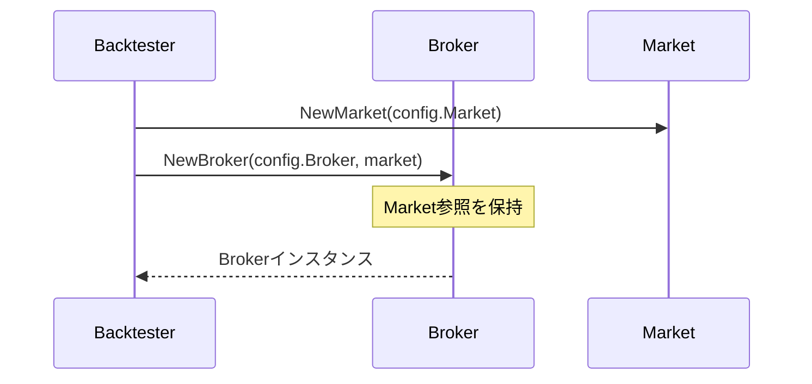
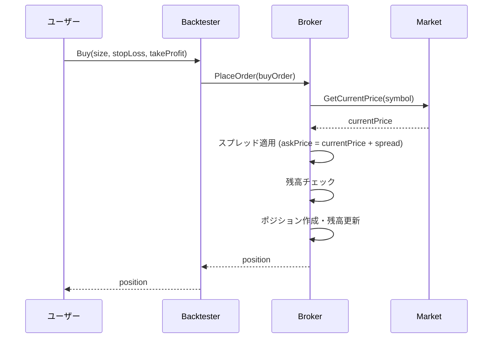
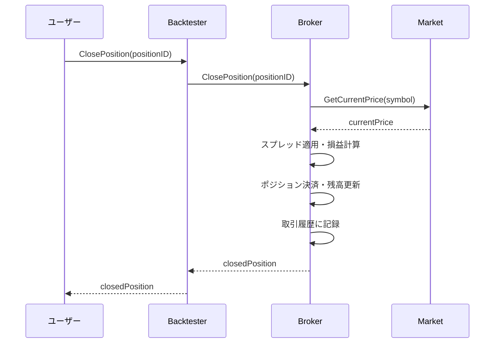

# Broker 設計書

## 1. 概要

Broker は、FXバックテストライブラリにおいて取引実行、ポジション管理、残高計算などを担当するコンポーネントです。`Backtester`の内部で使用され、Market情報を参照してスプレッド適用や現在価格での損益計算を実行します。リアルな取引環境を模倣し、スプレッドを考慮した高精度な取引シミュレーションを提供します。

## 2. 責務

- 成行・指値注文の実行と管理
- ポジションの開設・決済・追跡
- 残高・証拠金の管理
- Market情報を参照したスプレッド適用と現在価格取得
- リアルタイム損益計算
- 取引履歴の記録と管理

## 3. ファイル構成

```
pkg/broker/
├── broker.go              # Brokerインターフェースの定義
├── simple_broker.go       # Broker実装
├── broker_test.go         # Brokerのテスト
└── simple_broker_test.go  # SimpleBrokerのテスト
```

## 4. アーキテクチャ

### 4.1 Brokerインターフェース

すべてのBroker実装が満たすべき基本契約を定義します。

```go
package broker

import "fx-backtesting/pkg/models"

// Broker は、取引実行とポジション管理を行うインターフェースです。
type Broker interface {
    PlaceOrder(order models.Order) error
    ClosePosition(positionID string) error
    GetBalance() float64
    GetPositions() []models.Position
    GetTradeHistory() []models.Trade
}
```

### 4.2 SimpleBroker実装

MarketからのCurrentPrice参照を含む実装です。

```go
type SimpleBroker struct {
    config       models.BrokerConfig
    market       Market
    balance      float64
    positions    map[string]models.Position
    tradeHistory []models.Trade
}

// Market参照を含むコンストラクタ
func NewSimpleBroker(config models.BrokerConfig, market Market) *SimpleBroker {
    return &SimpleBroker{
        config:       config,
        market:       market,
        balance:      config.InitialBalance,
        positions:    make(map[string]models.Position),
        tradeHistory: make([]models.Trade, 0),
    }
}
```

## 5. データ構造

### 5.1 BrokerConfig（設定）

```go
type BrokerConfig struct {
    InitialBalance float64  // 初期残高
    Spread         float64  // スプレッド（pips）
}
```

### 5.2 Order（注文）

```go
type Order struct {
    ID         string
    Symbol     string
    Type       OrderType    // Market, Limit
    Side       OrderSide    // Buy, Sell
    Size       float64
    Price      float64
    StopLoss   float64
    TakeProfit float64
    Timestamp  time.Time
}
```

### 5.3 Position（ポジション）

```go
type Position struct {
    ID           string
    Symbol       string
    Side         OrderSide
    Size         float64
    EntryPrice   float64
    CurrentPrice float64
    PnL          float64
    OpenTime     time.Time
}
```

## 6. 処理フロー

### 6.1 初期化フロー



### 6.2 注文実行フロー



### 6.3 ポジション決済フロー



## 7. 主要機能

### 7.1 Market参照による価格取得

```go
func (b *SimpleBroker) PlaceOrder(order models.Order) error {
    // Marketから現在価格を取得
    currentPrice, err := b.market.GetCurrentPrice(order.Symbol)
    if err != nil {
        return err
    }
    
    // スプレッド適用
    var executionPrice float64
    if order.Side == models.Buy {
        executionPrice = currentPrice + b.config.Spread // Ask価格
    } else {
        executionPrice = currentPrice - b.config.Spread // Bid価格
    }
    
    // 残高チェック
    if b.balance < order.Size * executionPrice {
        return errors.New("insufficient balance")
    }
    
    // 注文実行処理...
}
```

### 7.2 残高管理

```go
func (b *SimpleBroker) hasEnoughBalance(size, price float64) bool {
    return b.balance >= (size * price)
}

func (b *SimpleBroker) updateBalance(amount float64) {
    b.balance += amount
}
```

### 7.3 リアルタイム損益計算

```go
func (b *SimpleBroker) updatePositionPnL(position *models.Position) error {
    currentPrice, err := b.market.GetCurrentPrice(position.Symbol)
    if err != nil {
        return err
    }
    
    position.CurrentPrice = currentPrice
    
    if position.Side == models.Buy {
        position.PnL = (currentPrice - position.EntryPrice) * position.Size
    } else {
        position.PnL = (position.EntryPrice - currentPrice) * position.Size
    }
    
    return nil
}
```

## 8. Backtesterとの統合

### 8.1 設定統合

```go
type Config struct {
    Market MarketConfig
    Broker BrokerConfig
}

// Backtester内での初期化
func NewBacktester(config Config) (*Backtester, error) {
    market := NewMarket(config.Market)
    broker := NewSimpleBroker(config.Broker, market)
    
    return &Backtester{
        config: config,
        market: market,
        broker: broker,
    }, nil
}
```

### 8.2 バックテストループでの連携

```go
func (bt *Backtester) Forward() bool {
    if !bt.market.Forward() {
        return false
    }
    
    // 全ポジションのPnLを現在価格で更新
    for _, position := range bt.broker.GetPositions() {
        bt.broker.updatePositionPnL(&position)
    }
    
    return true
}
```

## 9. 使用例

### 9.1 基本的な使用方法

```go
// 設定作成
brokerConfig := BrokerConfig{
    InitialBalance: 10000.0,
    Spread:         0.0001,  // 1 pip
}

// Market作成（省略）
market := NewMarket(marketConfig)

// Broker作成
broker := NewSimpleBroker(brokerConfig, market)

// 成行買い注文
order := models.Order{
    Symbol: "EURUSD",
    Type:   models.Market,
    Side:   models.Buy,
    Size:   10000.0,
}
err := broker.PlaceOrder(order)

// ポジション確認
positions := broker.GetPositions()
balance := broker.GetBalance()
```

## 10. テスト項目

### 10.1 単体テスト

#### 正常系テスト
- **基本的な注文実行**
  - 成行買い・売り注文の正常実行
  - Market価格参照の確認
  - スプレッド適用の確認
  - 手数料計算の確認

- **ポジション管理**
  - ポジション開設・決済
  - リアルタイム損益計算
  - 複数ポジションの管理

- **残高管理**
  - 初期残高設定
  - 残高チェック機能
  - 残高更新の確認

#### 異常系テスト
- **注文拒否**
  - 残高不足時の注文拒否
  - Market価格取得エラー時の処理

- **ポジション操作エラー**
  - 存在しないポジションの決済
  - Market価格取得失敗時の処理

### 10.2 統合テスト

#### Marketとの統合
- **価格データ連携**
  - Market.GetCurrentPrice()の正常呼び出し
  - 価格更新時のポジションPnL自動更新
  - Market価格取得エラーのハンドリング

#### Backtesterとの統合
- **データフロー確認**
  - 注文実行とBacktesterの連携
  - ポジション情報の同期
  - 取引履歴の整合性

### 10.3 テスト実行方法

```bash
# 全テスト実行
go test ./pkg/broker/...

# カバレッジ確認
go test -cover ./pkg/broker/...

# 特定のテストケース
go test -run TestSimpleBroker_PlaceOrder ./pkg/broker/

# ベンチマークテスト
go test -bench . ./pkg/broker/
```

### 10.4 テスト品質指標

- **カバレッジ**: 85%以上を目標
- **境界値テスト**: 全ての数値パラメータで実施
- **エラーハンドリング**: 全てのエラーケースをカバー
- **Market統合テスト**: Market依存の全機能をテスト

## 11. 拡張性

### 11.1 新しい注文タイプの追加

```go
type OrderType int
const (
    Market OrderType = iota
    Limit
    Stop
    // 新しい注文タイプを追加可能
)
```

### 11.2 カスタムBroker実装

```go
type CustomBroker struct {
    *SimpleBroker
    // カスタム機能の追加
}

func (b *CustomBroker) PlaceOrder(order models.Order) error {
    // カスタム注文処理ロジック
    return b.SimpleBroker.PlaceOrder(order)
}
```

この設計により、現実的で高精度なFXバックテスト環境を提供し、Marketとの密な連携により正確な価格参照と取引シミュレーションを実現します。