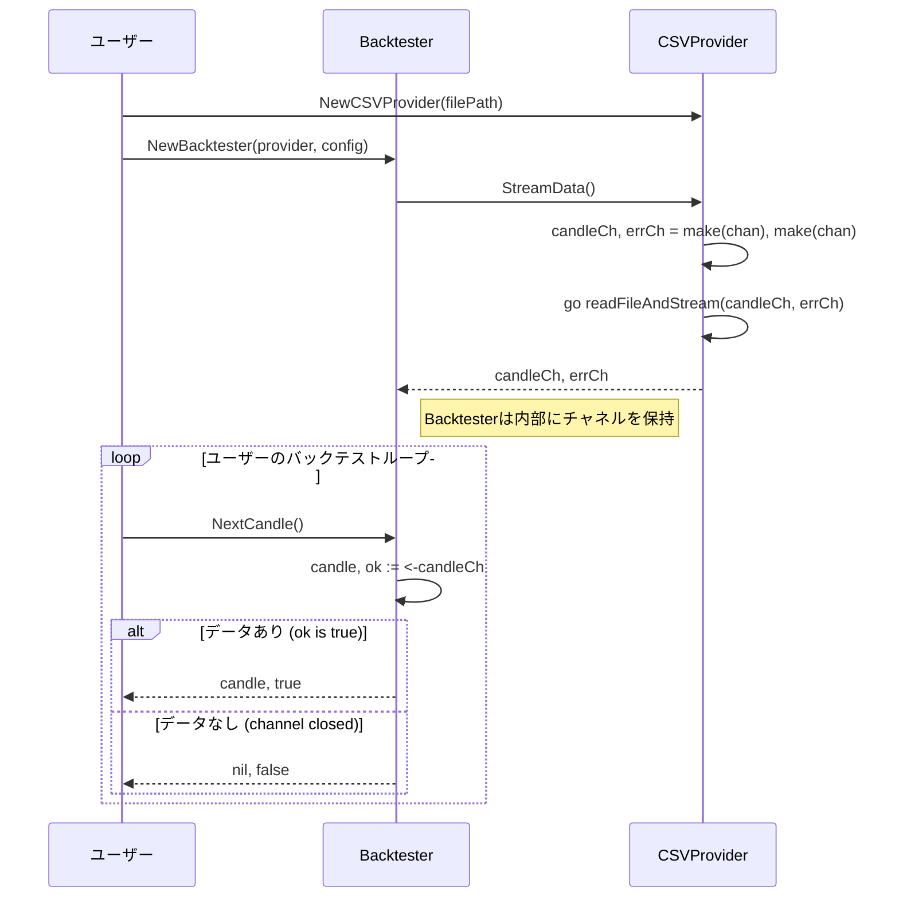

# DataProvider 設計書

## 1. 概要

DataProvider は、バックテストに必要なヒストリカルデータを外部ソースから読み込み、リアルタイムのデータフィードを模倣した**ストリーム**として供給する責務を負うコンポーネントです。

Go のチャネルを利用することで、巨大なデータセットでもメモリ効率よく処理することが可能になります。

## 2. 責務

- 指定されたデータソースを開き、データストリームを準備する。
- データを一件ずつ `models.Candle` に変換し、チャネルに送信する。
- ストリームの終端またはエラー発生時にチャネルをクローズする。
- ファイルが見つからない等の初期化エラーと、パース失敗等のストリーム中のエラーをハンドリングする。

## 3. ファイル構成

`pkg/data/` ディレクトリ配下のファイル構成は変更ありません。

```
pkg/data/
├── provider.go          # DataProviderインターフェースの定義
├── csv_provider.go      # CSV形式のデータを扱う具体的な実装
├── parser.go            # データ行をCandleモデルに変換するパーサー
├── provider_test.go     # プロバイダーのテスト
└── parser_test.go       # パーサーのテスト
```

## 4. API 設計

### `provider.go`

データストリームを取得するためのインターフェースを定義します。

```go
package data

import "fx-backtesting/pkg/models"

// DataProvider は、ローソク足データをストリームとして供給するためのインターフェースです。
type DataProvider interface {
    // StreamData は、ローソク足データとエラーを送信するチャネルを返します。
    // 初期化処理（ファイルオープン等）でエラーが発生した場合は、第三戻り値としてerrorを返します。
    StreamData() (<-chan models.Candle, <-chan error, error)
}
```

### `csv_provider.go`

`DataProvider`インターフェースの CSV ファイル用の実装です。

```go
package data

import "fx-backtesting/pkg/models"

// CSVProvider は、CSVファイルからデータをストリームで読み込むためのDataProviderです。
type CSVProvider struct {
    filePath string
    parser   Parser
}

// NewCSVProvider は新しいCSVProviderを生成します。
func NewCSVProvider(filePath string) *CSVProvider {
    return &CSVProvider{
        filePath: filePath,
        parser:   NewCSVParser(),
    }
}

// StreamData は、goroutineを起動してCSVファイルを読み込み、
// その結果をチャネル経由で送信します。
func (p *CSVProvider) StreamData() (<-chan models.Candle, <-chan error, error) {
    // チャネルの作成と、ファイル読み込みgoroutineの起動
    // ...
    return nil, nil, nil
}
```

`parser.go` の設計は変更ありません。

## 5. 処理フロー

`Backtester` が `DataProvider` を利用してデータストリームを取得し、処理する際のフローです。



## 6. 拡張性

新しいデータソース（例: WebSocket）に対応させる場合も同様です。

1.  `pkg/data/` に `websocket_provider.go` を作成します。
2.  `WebSocketProvider` 構造体を定義し、`DataProvider` インターフェースの `StreamData()` メソッドを実装します。このメソッド内で WebSocket に接続し、受信したメッセージをパースしてチャネルに送信します。

`Backtester` は `DataProvider` インターフェースにのみ依存するため、データソースの具体的な実装を意識することなく、一貫した方法でデータストリームを扱うことができます。
