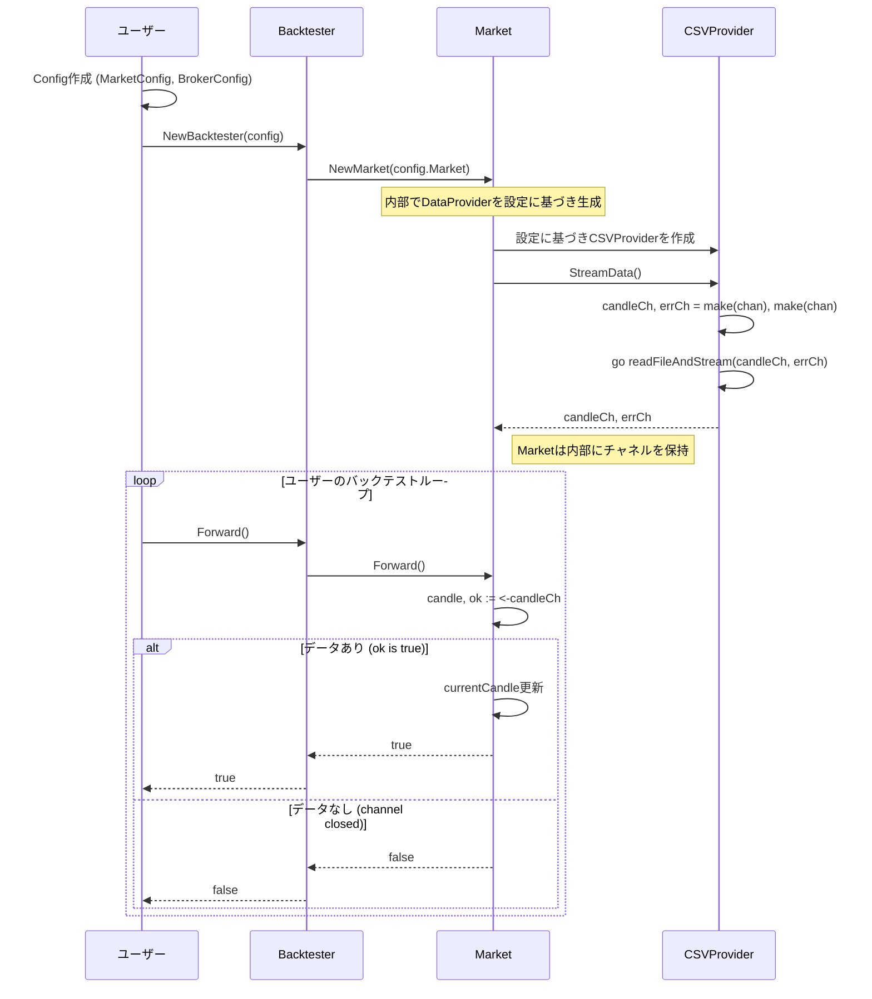

# DataProvider 設計書

## 1. 概要

DataProvider は、純粋なデータ読み込み責務を担当するコンポーネントです。CSV ファイルやデータベースなどの外部データソースから生データを読み込み、`Market` コンポーネント経由でバックテストシステムに供給します。

Go のチャネルを利用することで、巨大なデータセットでもメモリ効率よく処理することが可能になります。

## 2. 責務

- 指定されたデータソースを開き、データストリームを準備する。
- データを一件ずつ `models.Candle` に変換し、チャネルに送信する。
- ストリームの終端またはエラー発生時にチャネルをクローズする。
- ファイルが見つからない等の初期化エラーと、パース失敗等のストリーム中のエラーをハンドリングする。

## 3. ファイル構成

`pkg/data/` ディレクトリ配下のファイル構成は変更ありません。

```
pkg/data/
├── provider.go          # DataProviderインターフェースの定義
├── csv_provider.go      # CSV形式のデータを扱う具体的な実装
├── parser.go            # データ行をCandleモデルに変換するパーサー
├── provider_test.go     # プロバイダーのテスト
└── parser_test.go       # パーサーのテスト
```

## 4. API 設計

### `provider.go`

データストリームを取得するためのインターフェースを定義します。

```go
package data

import "fx-backtesting/pkg/models"

// DataProvider は、ローソク足データをストリームとして供給するためのインターフェースです。
type DataProvider interface {
    // StreamData は、ローソク足データとエラーを送信するチャネルを返します。
    // 初期化処理（ファイルオープン等）でエラーが発生した場合は、第三戻り値としてerrorを返します。
    StreamData() (<-chan models.Candle, <-chan error, error)
}
```

### `csv_provider.go`

`DataProvider`インターフェースの CSV ファイル用の実装です。

```go
package data

import "fx-backtesting/pkg/models"

// CSVProvider は、CSVファイルからデータをストリームで読み込むためのDataProviderです。
type CSVProvider struct {
    filePath string
    parser   Parser
}

// NewCSVProvider は新しいCSVProviderを生成します。
func NewCSVProvider(filePath string) *CSVProvider {
    return &CSVProvider{
        filePath: filePath,
        parser:   NewCSVParser(),
    }
}

// StreamData は、goroutineを起動してCSVファイルを読み込み、
// その結果をチャネル経由で送信します。
func (p *CSVProvider) StreamData() (<-chan models.Candle, <-chan error, error) {
    // チャネルの作成と、ファイル読み込みgoroutineの起動
    // ...
    return nil, nil, nil
}
```

`parser.go` の設計は変更ありません。

## 5. 処理フロー

`Market` が `DataProvider` を利用してデータストリームを取得し、バックテストシステムに供給する際のフローです。



## 6. 拡張性

新しいデータソース（例: WebSocket、Database）に対応させる場合も同様です。

1.  `pkg/data/` に `websocket_provider.go` や `database_provider.go` を作成します。
2.  `WebSocketProvider` 構造体を定義し、`DataProvider` インターフェースの `StreamData()` メソッドを実装します。このメソッド内で WebSocket に接続し、受信したメッセージをパースしてチャネルに送信します。
3.  `DataProviderConfig` に WebSocket 接続に必要な設定項目を追加します。
4.  `Market` の内部でConfigに基づいて適切なProviderを生成するロジックを拡張します。

`Market` は `DataProvider` インターフェースにのみ依存するため、データソースの具体的な実装を意識することなく、一貫した方法でデータストリームを扱うことができます。DataProviderは純粋なデータ読み込み責務に集中し、市場データの管理はMarketが担当します。

## 7. 設定統合

DataProviderは `Market` 経由で `Config` システムと統合されており、以下の構造で設定されます：

```go
type Config struct {
    Market MarketConfig
    Broker BrokerConfig
}

type MarketConfig struct {
    DataProvider DataProviderConfig
}

type DataProviderConfig struct {
    FilePath string
    // 将来的にTimeframe、DataSource種別などを追加
}
```

この設計により、ユーザーはすべての設定を一箇所で管理し、`NewBacktester(config)` の単一呼び出しでバックテストを開始できます。DataProviderの設定はMarketConfig内に含まれ、責務の階層が明確になります。

## 8. テスト項目

DataProviderの品質を保証するため、以下のテストケースを実装する必要があります。

### 8.1 CSVProvider テスト (`provider_test.go`)

#### 正常系テスト
- **有効なCSVファイルの読み込み**
  - 標準的なCSVファイルからデータを正常に読み込める
  - チャネルから期待される順序でCandleデータが取得できる
  - 全データ読み込み後にチャネルが正常にクローズされる

- **大容量データの処理**
  - 大量のレコードを含むCSVファイルの処理
  - メモリ効率の確認（一度に全データを読み込まない）
  - Goroutineによる非同期処理の動作確認

#### 異常系テスト
- **ファイル関連エラー**
  - 存在しないファイルパスの指定
  - 読み込み権限のないファイルの指定
  - 空のファイルの処理

- **データ形式エラー**
  - 不正なCSVフォーマット（カラム数不足、型不一致）
  - 不正な日時形式
  - 不正な数値形式（価格、出来高）

- **ストリーミングエラー**
  - 読み込み中のファイルI/Oエラー
  - パース処理中のエラー
  - エラーチャネルへの適切なエラー送信

### 8.2 Parser テスト (`parser_test.go`)

#### 正常系テスト
- **標準的なCSV行の解析**
  - 正しい形式の行を`models.Candle`に正常変換
  - 各フィールド（timestamp, OHLCV）の正確な解析
  - 異なる日時形式への対応

- **境界値テスト**
  - 最小値・最大値の価格データ
  - ゼロ出来高の処理
  - 極端に小さい/大きい数値の処理

#### 異常系テスト
- **フォーマットエラー**
  - カラム数が不足した行
  - 空の行やヘッダー行
  - 不正な文字エンコーディング

- **データ型エラー**
  - 数値フィールドに文字列が含まれる
  - 日時フィールドに不正な値
  - 負の価格や出来高

### 8.3 統合テスト

#### Marketとの統合
- **データフロー確認**
  - `StreamData()`で返されるチャネルが`Market`で正常に処理される
  - エラーハンドリングがMarketレベルで適切に処理される

- **設定統合テスト**
  - `DataProviderConfig`がMarket経由で正しくCSVProviderに反映される
  - 設定変更時の動作確認
  
#### Backtesterとの間接統合
- **Market経由のデータフロー**
  - DataProvider → Market → Backtesterの完全なデータフローの確認
  - エラーが適切にBacktesterまで伝播される

#### パフォーマンステスト
- **メモリ使用量**
  - 大容量ファイル処理時のメモリ効率
  - Goroutineのリソース管理

- **処理速度**
  - 大量データの読み込み性能
  - チャネル経由の非同期処理性能

### 8.4 テストデータ準備

#### テスト用CSVファイル
```csv
# testdata/valid_sample.csv
timestamp,open,high,low,close,volume
2024-01-01 00:00:00,1.0500,1.0520,1.0490,1.0510,1000
2024-01-01 00:01:00,1.0510,1.0530,1.0500,1.0520,1200
```

#### エラーケース用ファイル
```csv
# testdata/invalid_format.csv
timestamp,open,high,low,close,volume
2024-01-01 00:00:00,1.0500,1.0520,1.0490  # カラム不足
2024-01-01 00:01:00,invalid,1.0530,1.0500,1.0520,1200  # 不正な数値
```

### 8.5 テスト実行方法

```bash
# 全テスト実行
go test ./pkg/data/...

# カバレッジ確認
go test -cover ./pkg/data/...

# 特定のテストケースのみ実行
go test -run TestCSVProvider_ValidFile ./pkg/data/

# ベンチマークテスト
go test -bench . ./pkg/data/
```

### 8.6 テストの品質指標

- **カバレッジ**: 80%以上を目標
- **境界値テスト**: 全ての入力パラメータで実施
- **エラーハンドリング**: 全てのエラーケースをカバー
- **パフォーマンス**: 大容量データ（1GB以上）での動作確認
