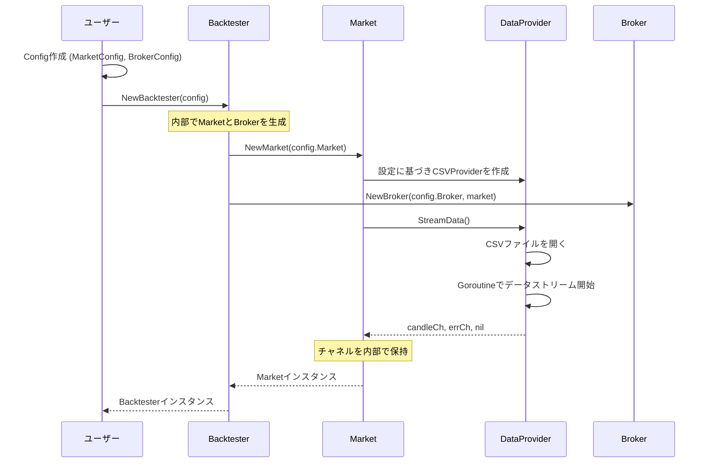
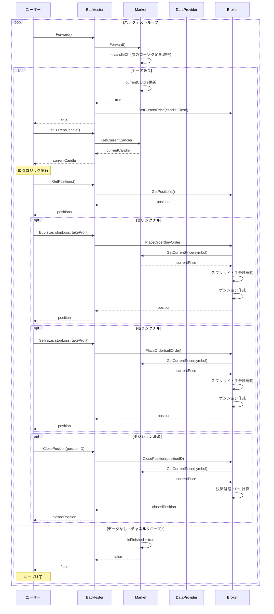
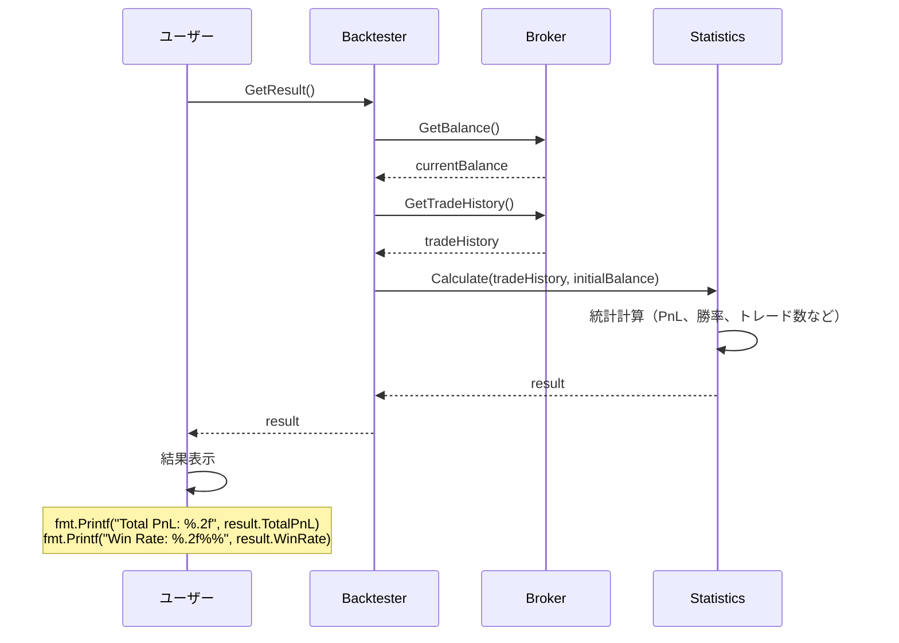

# FX バックテストライブラリ設計書

## 概要

Go 言語で実装する FX バックテストライブラリ。ヒストリカルデータを使用し、ユーザーが Go コード内で直接記述した取引ロジックのバックテストを実行する。イテレータパターンの採用により、直感的で柔軟なテスト記述を可能にする。

## 要件

- CSV ファイルからヒストリカルデータを読み込み
- スプレッド、初期投資額などの設定に対応
- ユーザーがループで 1 本ずつローソク足を進め、取引を実行できる
- バックテスト結果の統計情報出力

## アーキテクチャ

### コアコンポーネント

#### 1. Backtester

バックテストの実行全体を管理するコアコンポーネント。市場データの取得、ブローカーの操作、状態の更新など、すべての責務を内部にカプセル化する。

```go
// Backtesterは、市場データアクセス、注文実行、状態管理をすべて内包します。
type Backtester struct {
    config Config
    market Market
    broker broker.Broker
}
```

#### 2. Market (内部コンポーネント)

`Backtester`の内部で使用されるコンポーネント。市場情報の提供と管理を行う。内部で DataProvider を使用してデータソースからローソク足データを取得する。

```go
// Marketは、市場情報を提供するインターフェースです。
type Market interface {
    GetCurrentPrice(symbol string) (float64, error)
    GetCurrentCandle(symbol string) (models.Candle, error)
    Forward() bool  // 次の時刻に進む
    IsFinished() bool
}

// MarketImpl: Market実装
type MarketImpl struct {
    dataProvider  data.DataProvider
    candleCh      <-chan models.Candle
    errCh         <-chan error
    currentCandle models.Candle
    isFinished    bool
}
```

#### 3. DataProvider (内部コンポーネント)

`Market`の内部で使用されるコンポーネント。純粋なデータ読み込み責務を担当し、CSV ファイルなどのデータソースからローソク足データをストリームとして供給する。

#### 4. Broker (内部コンポーネント)

`Backtester`の内部で使用されるコンポーネント。注文の実行、ポジション管理、残高計算などを行う。Market 情報を参照してスプレッド適用や現在価格での損益計算を実行する。

### データ構造

#### Config (トップレベル設定)

バックテストに必要なすべての設定をまとめる構造体。

```go
type Config struct {
    Market MarketConfig
    Broker BrokerConfig
}

// MarketConfig は市場に関する設定です。
type MarketConfig struct {
    DataProvider DataProviderConfig
}

// DataProviderConfig はデータプロバイダーに関する設定です。
type DataProviderConfig struct {
    FilePath string
    // Timeframe string などを将来的に追加
}

// BrokerConfig はブローカーに関する設定です。
type BrokerConfig {
    InitialBalance float64
    Spread         float64
}
```

`Candle`, `Order`, `Position`の定義は変更ありません。

## 実装フロー

1.  **初期化**: ユーザーは `MarketConfig` と `BrokerConfig` を含む `Config` オブジェクトを作成する。
2.  **Backtester 生成**: `NewBacktester(config)` を呼び出す。
    - `NewBacktester` 内部で `Market` を設定に基づき生成する。
    - `Market` 内部で `DataProvider` を生成し、`DataProvider.StreamData()` を呼び出してデータチャネルを取得・保持する。
    - `Broker` を生成し、Market 参照を設定してスプレッド適用や価格取得を可能にする。
3.  **バックテストループ**: ユーザーは `for bt.Forward()` ループを記述する。
    - `bt.Forward()`: 内部で `market.Forward()` を呼び出し、Market 経由で次のローソク足を取得する。データがなくなれば `false` を返す。
    - `bt.GetCurrentCandle()`: ループ内で `market.GetCurrentCandle()` 経由で現在のローソク足データを取得する。
    - `bt.Buy()` / `bt.Sell()`: ユーザーは取引ロジックに基づき、注文関数を呼び出す。
4.  **結果取得**: ループ終了後、`bt.GetResult()` などで統計情報を取得する。

## 使用例

```go
package main

import (
    "fmt"
    "log"
    "fx-backtesting/pkg/backtester"
)

func main() {
    // データソースに関する設定
    dpConfig := backtester.DataProviderConfig{
        FilePath: "./testdata/EURUSD_M1.csv",
    }

    // 市場に関する設定
    marketConfig := backtester.MarketConfig{
        DataProvider: dpConfig,
    }

    // ブローカーに関する設定
    brokerConfig := backtester.BrokerConfig{
        InitialBalance: 10000.0,
        Spread:         0.0001, // 1 pip
    }

    // バックテストに関する設定
    backtestConfig := backtester.BacktestConfig{
        StartTime: "2023-01-01T00:00:00Z",
        EndTime:   "2023-01-31T23:59:59Z",
    }

    // バックテスト全体の設定
    config := backtester.Config{
        Market: marketConfig,
        Broker: brokerConfig,
        Backtest: backtestConfig,
    }

    // バックテスターの作成
    bt, err := backtester.NewBacktester(config)
    if err != nil {
        log.Fatalf("Failed to create backtester: %v", err)
    }

    // バックテスト実行ループ
    for bt.Forward() {
        candle, err := bt.GetCurrentCandle()
        if err != nil {
            log.Printf("Cannot get current candle: %v", err)
            continue
        }

        // 単純な取引ロジックの例：
        // 終値が1.1より大きく、ポジションがなければ買い
        positions := bt.GetPositions()
        if candle.Close > 1.1 && len(positions) == 0 {
            size := 10000.0 // 10,000通貨
            _, err := bt.Buy(size, 0, 0) // 成行買い
            if err != nil {
                log.Printf("Buy order failed: %v", err)
            }
        }

        // 終値が1.1より小さく、ポジションがあれば決済
        if candle.Close < 1.1 && len(positions) > 0 {
            for _, p := range positions {
                bt.ClosePosition(p.ID)
            }
        }
    }

    // 結果の表示
    result, err := bt.GetResult()
    if err != nil {
        log.Fatalf("Failed to get result: %v", err)
    }

    fmt.Printf("Total PnL: %.2f\n", result.TotalPnL)
    fmt.Printf("Win Rate: %.2f%%\n", result.WinRate)
    fmt.Printf("Total Trades: %d\n", result.TotalTrades)
}
```

## シーケンス図

### 初期化フロー



### バックテストループ実行フロー



### 結果取得フロー



## プロジェクト構造

```
fx-backtesting/
├── pkg/
│   ├── backtester/ # Backtesterと各種Configを定義
│   ├── market/     # Marketのインターフェースと実装
│   ├── broker/     # Brokerのインターフェースと実装
│   ├── data/       # DataProviderのインターフェースと実装
│   ├── models/     # Candle, Order等のデータ構造
│   └── statistics/ # 統計計算
# ... (その他)
```
