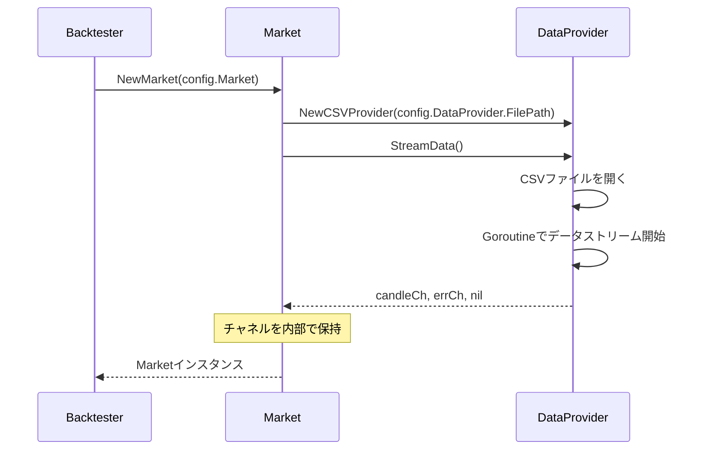
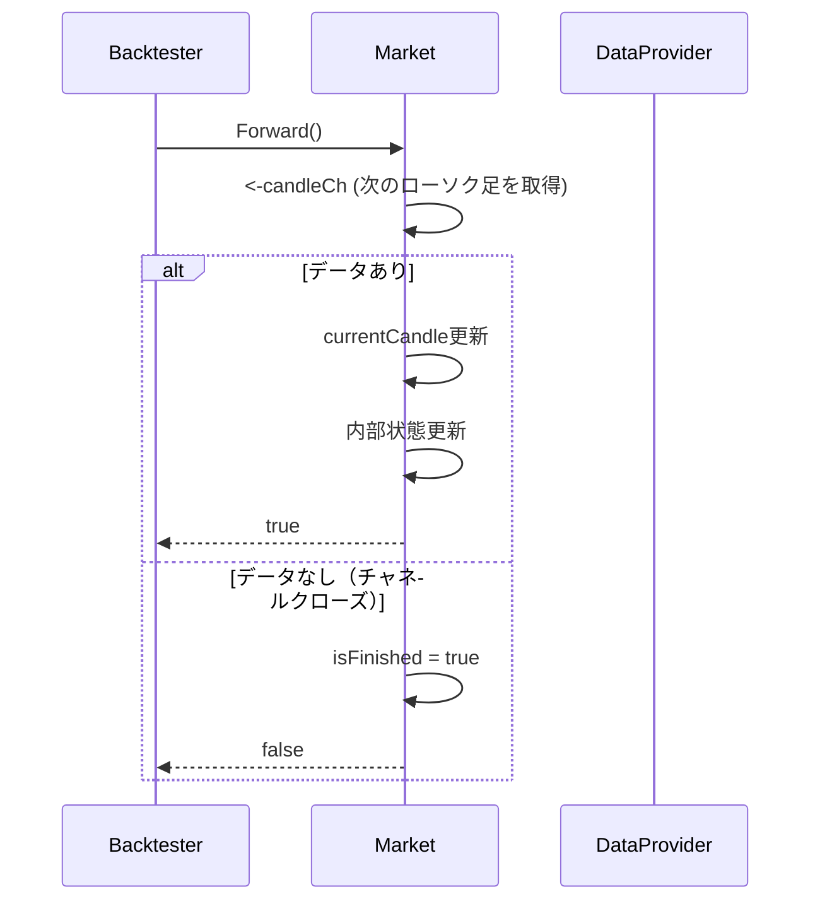
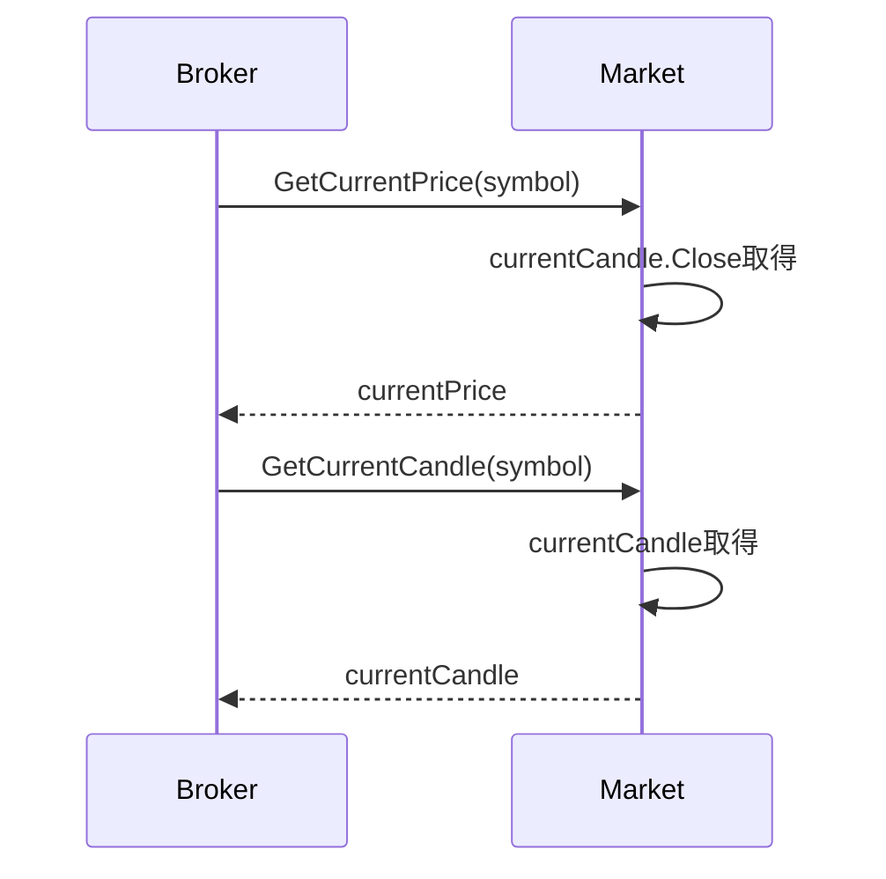

# Market 設計書

## 1. 概要

Market は、FXバックテストライブラリにおいて市場情報の提供と管理を行うコンポーネントです。`Backtester`の内部で使用され、内部でDataProviderを使用してデータソースからローソク足データを取得します。市場データの抽象化層として機能し、`Broker`への価格情報提供と、バックテストの時間進行管理を担当します。

## 2. 責務

- 市場データの抽象化と管理
- DataProviderを使用したデータストリーム管理
- 現在価格の提供（Brokerへの価格情報供給）
- バックテストの時間進行制御（Forward機能）
- 現在のローソク足データの保持と提供
- 市場状態の管理（開始・終了判定）

## 3. ファイル構成

```
pkg/market/
├── market.go          # Marketインターフェースの定義
├── market_impl.go     # Market実装
├── market_test.go     # Marketのテスト
└── mock_market.go     # テスト用モックMarket
```

## 4. アーキテクチャ

### 4.1 Marketインターフェース

市場情報を提供するための基本契約を定義します。

```go
package market

import "fx-backtesting/pkg/models"

// Market は、市場情報を提供するインターフェースです。
type Market interface {
    GetCurrentPrice(symbol string) (float64, error)
    GetCurrentCandle(symbol string) (models.Candle, error)
    Forward() bool  // 次の時刻に進む
    IsFinished() bool
}
```

### 4.2 MarketImpl実装

DataProviderを内部で使用する実装です。

```go
type MarketImpl struct {
    config        models.MarketConfig
    dataProvider  data.DataProvider
    candleCh      <-chan models.Candle
    errCh         <-chan error
    currentCandle models.Candle
    isFinished    bool
    symbol        string
}

// DataProviderを内部で生成するコンストラクタ
func NewMarket(config models.MarketConfig) (*MarketImpl, error) {
    // DataProviderを設定に基づき生成
    dataProvider := data.NewCSVProvider(config.DataProvider.FilePath)
    
    // データストリーム開始
    candleCh, errCh, err := dataProvider.StreamData()
    if err != nil {
        return nil, err
    }
    
    return &MarketImpl{
        config:       config,
        dataProvider: dataProvider,
        candleCh:     candleCh,
        errCh:        errCh,
        isFinished:   false,
        symbol:       "EURUSD", // 設定から取得
    }, nil
}
```

## 5. データ構造

### 5.1 MarketConfig（設定）

```go
type MarketConfig struct {
    DataProvider DataProviderConfig
    Symbol       string // 取引通貨ペア
}

type DataProviderConfig struct {
    FilePath string
    // 将来的にTimeframe、DataSource種別などを追加
}
```

### 5.2 Market状態管理

```go
type MarketState struct {
    CurrentCandle models.Candle
    IsActive      bool
    Symbol        string
    LastUpdate    time.Time
}
```

## 6. 処理フロー

### 6.1 初期化フロー



### 6.2 時間進行フロー（Forward）



### 6.3 価格取得フロー



## 7. 主要機能

### 7.1 時間進行制御

```go
func (m *MarketImpl) Forward() bool {
    if m.isFinished {
        return false
    }
    
    select {
    case candle, ok := <-m.candleCh:
        if !ok {
            m.isFinished = true
            return false
        }
        m.currentCandle = candle
        return true
    case err := <-m.errCh:
        log.Printf("Market error: %v", err)
        m.isFinished = true
        return false
    default:
        return false
    }
}
```

### 7.2 現在価格提供

```go
func (m *MarketImpl) GetCurrentPrice(symbol string) (float64, error) {
    if m.isFinished {
        return 0, errors.New("market is closed")
    }
    
    if symbol != m.symbol {
        return 0, errors.New("unsupported symbol")
    }
    
    return m.currentCandle.Close, nil
}
```

### 7.3 ローソク足データ提供

```go
func (m *MarketImpl) GetCurrentCandle(symbol string) (models.Candle, error) {
    if m.isFinished {
        return models.Candle{}, errors.New("market is closed")
    }
    
    if symbol != m.symbol {
        return models.Candle{}, errors.New("unsupported symbol")
    }
    
    return m.currentCandle, nil
}
```

### 7.4 市場状態管理

```go
func (m *MarketImpl) IsFinished() bool {
    return m.isFinished
}

func (m *MarketImpl) GetMarketState() MarketState {
    return MarketState{
        CurrentCandle: m.currentCandle,
        IsActive:      !m.isFinished,
        Symbol:        m.symbol,
        LastUpdate:    time.Now(),
    }
}
```

## 8. Backtester・Brokerとの統合

### 8.1 設定統合

```go
type Config struct {
    Market MarketConfig
    Broker BrokerConfig
}

// Backtester内での初期化
func NewBacktester(config Config) (*Backtester, error) {
    market, err := NewMarket(config.Market)
    if err != nil {
        return nil, err
    }
    
    broker := NewSimpleBroker(config.Broker, market)
    
    return &Backtester{
        config: config,
        market: market,
        broker: broker,
    }, nil
}
```

### 8.2 バックテストループでの連携

```go
func (bt *Backtester) Forward() bool {
    // Marketの時間を進める
    if !bt.market.Forward() {
        return false
    }
    
    // Brokerのポジション更新（価格はMarketから取得）
    for _, position := range bt.broker.GetPositions() {
        bt.broker.updatePositionPnL(&position)
    }
    
    return true
}

func (bt *Backtester) GetCurrentCandle() (models.Candle, error) {
    return bt.market.GetCurrentCandle(bt.symbol)
}
```

### 8.3 Brokerとの連携

```go
// Broker内での価格取得
func (b *SimpleBroker) PlaceOrder(order models.Order) error {
    currentPrice, err := b.market.GetCurrentPrice(order.Symbol)
    if err != nil {
        return err
    }
    
    // スプレッド適用と注文実行...
}
```

## 9. 使用例

### 9.1 基本的な使用方法

```go
// 設定作成
dpConfig := DataProviderConfig{
    FilePath: "./testdata/EURUSD_M1.csv",
}

marketConfig := MarketConfig{
    DataProvider: dpConfig,
    Symbol:       "EURUSD",
}

// Market作成
market, err := NewMarket(marketConfig)
if err != nil {
    log.Fatalf("Failed to create market: %v", err)
}

// 時間進行と価格取得
for market.Forward() {
    candle, _ := market.GetCurrentCandle("EURUSD")
    price, _ := market.GetCurrentPrice("EURUSD")
    
    fmt.Printf("Time: %v, Price: %.5f\n", candle.Timestamp, price)
}
```

### 9.2 Backtester統合での使用

```go
// 設定作成
config := Config{
    Market: marketConfig,
    Broker: brokerConfig,
}

// Backtester作成（内部でMarket生成）
bt, err := NewBacktester(config)
if err != nil {
    log.Fatalf("Failed to create backtester: %v", err)
}

// バックテストループ
for bt.Forward() {
    candle, _ := bt.GetCurrentCandle()
    // 取引ロジック実行...
}
```

## 10. テスト項目

### 10.1 単体テスト

#### 正常系テスト
- **データストリーム管理**
  - DataProviderからの正常なデータ取得
  - チャネル経由での非同期データ処理
  - 時間進行制御の確認

- **価格情報提供**
  - GetCurrentPrice()の正確な価格返却
  - GetCurrentCandle()の正確なデータ返却
  - 複数回の価格取得での整合性

- **状態管理**
  - Forward()による時間進行
  - IsFinished()による終了判定
  - Market状態の正確な管理

#### 異常系テスト
- **データソースエラー**
  - DataProvider初期化失敗時の処理
  - データストリーム中のエラーハンドリング
  - 無効なシンボル指定時のエラー

- **市場終了状態**
  - 終了後の価格取得エラー
  - 終了後のForward()呼び出し
  - 終了状態での各種操作

### 10.2 統合テスト

#### DataProviderとの統合
- **データフロー確認**
  - DataProvider.StreamData()との正常連携
  - エラーチャネルの適切な処理
  - 大容量データでの動作確認

#### Brokerとの統合
- **価格提供機能**
  - Broker.PlaceOrder()での価格取得
  - ポジション更新での価格参照
  - 価格取得エラー時のBroker動作

#### Backtesterとの統合
- **バックテストフロー**
  - Forward()の連鎖動作
  - 時間進行とデータ同期
  - 完全なバックテストサイクル

### 10.3 テスト実行方法

```bash
# 全テスト実行
go test ./pkg/market/...

# カバレッジ確認
go test -cover ./pkg/market/...

# 特定のテストケース
go test -run TestMarket_Forward ./pkg/market/

# ベンチマークテスト
go test -bench . ./pkg/market/
```

### 10.4 テスト品質指標

- **カバレッジ**: 85%以上を目標
- **境界値テスト**: 時間進行とデータ終端での全パターン
- **エラーハンドリング**: DataProvider連携の全エラーケース
- **統合テスト**: Broker・Backtesterとの完全連携確認

## 11. 拡張性

### 11.1 複数通貨ペア対応

```go
type MultiSymbolMarket struct {
    markets map[string]*MarketImpl
    config  MultiSymbolConfig
}

func (m *MultiSymbolMarket) GetCurrentPrice(symbol string) (float64, error) {
    market, exists := m.markets[symbol]
    if !exists {
        return 0, errors.New("unsupported symbol")
    }
    return market.GetCurrentPrice(symbol)
}
```

### 11.2 リアルタイムデータソース対応

```go
type RealtimeMarket struct {
    *MarketImpl
    websocketClient *WebSocketClient
    apiClient       *APIClient
}

func (m *RealtimeMarket) Forward() bool {
    // WebSocketまたはAPIからリアルタイムデータを取得
    data := m.websocketClient.GetLatestData()
    m.currentCandle = data.ToCandle()
    return true
}
```

### 11.3 カスタムMarket実装

```go
type CustomMarket struct {
    // カスタム機能の追加
}

func (m *CustomMarket) GetCurrentPrice(symbol string) (float64, error) {
    // カスタム価格取得ロジック
    return customPriceCalculation(symbol)
}
```

## 12. パフォーマンス考慮事項

### 12.1 メモリ効率

- データストリーム処理による省メモリ設計
- 不要なデータの即座解放
- チャネルバッファサイズの最適化

### 12.2 処理速度

- 価格取得処理の高速化
- キャッシュ機能の実装検討
- 並行処理での安全性確保

この設計により、市場データの抽象化と効率的な管理を実現し、BacktesterとBrokerへの統一的な市場情報提供を可能にします。レバレッジや手数料といった複雑な金融計算は含まず、シンプルで理解しやすい設計を目指しています。