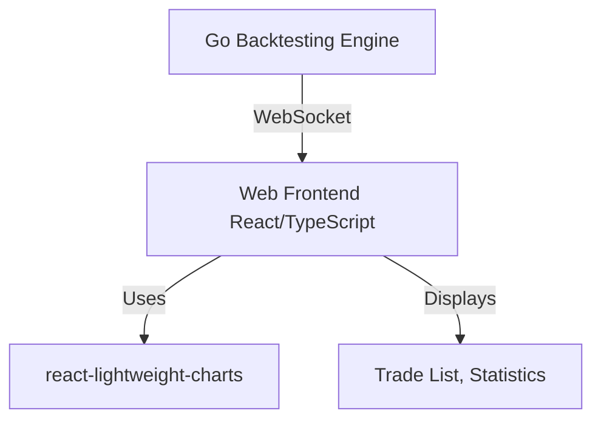

# FX バックテストライブラリ 拡張設計書: ビジュアルモード

## 1. 概要

既存の FX バックテストライブラリにビジュアルモードを追加し、バックテストの実行状況をリアルタイムでチャート上に可視化する機能を提供する。MT5 のストラテジーテスターのようなユーザー体験を目指し、取引履歴、ポジション、損益などを直感的に把握できるようにする。

## 2. 要件

- バックテストの進行に合わせて、ローソク足チャートをリアルタイムで更新する。
- チャート上に取引（エントリー、エグジット）ポイント、ポジションの損益状況を表示する。
- バックテストの実行速度を調整できる機能（例: スライダーで速度変更）。
- バックテストの一時停止、再開、スキップ機能。
- 主要な統計情報（残高、総損益など）をリアルタイムで表示する。
- 使用するチャートライブラリ: `react-lightweight-charts`

## 3. アーキテクチャ

### 3.1 全体構成

Go 言語で実装されたバックテストエンジンと、React/TypeScript で実装された Web ベースのフロントエンドを組み合わせる。両者間の通信には WebSocket を使用し、リアルタイム性の高いデータ転送を実現する。

### 3.2 コアコンポーネント

#### 3.2.1 Go Backtesting Engine (Backend)

既存の`backtester`パッケージを拡張し、ビジュアルモード用のデータストリーム機能を追加する。

- **`backtester.Backtester`の拡張**:
  - WebSocket サーバーを起動し、フロントエンドからの接続を管理する。
  - バックテストの各ステップ（`Forward()`呼び出し後）で、現在のチャートデータ（ローソク足）と取引イベント（新規注文、ポジション更新、決済など）を JSON 形式で WebSocket 経由でブロードキャストする。
  - フロントエンドからの制御コマンド（一時停止、再開、速度変更など）を受信するハンドラを実装する。
- **データ構造の定義**: フロントエンドに送信するデータ（ローソク足、取引イベント）の Go 構造体を定義し、JSON シリアライズ可能にする。

#### 3.2.2 Web Frontend (React/TypeScript)

`create-react-app`などでプロジェクトを初期化し、以下の主要コンポーネントを実装する。

- **WebSocket Client**: Go バックエンドとの WebSocket 接続を確立し、受信したデータを処理する。
- **Chart Component**: `react-lightweight-charts`を使用して、受信したローソク足データを表示し、取引イベントをオーバーレイで描画する。
- **Control Panel**: バックテストの実行速度調整、一時停止、再開、スキップなどの UI を提供する。
- **Statistics Display**: リアルタイムで更新される統計情報（残高、損益など）を表示する。
- **Trade List**: 発生した取引を一覧表示する。

### 3.3 データフロー

1.  **接続確立**: フロントエンドが Go バックエンドの WebSocket エンドポイントに接続。
2.  **バックテスト開始**: フロントエンドからバックエンドへバックテスト開始コマンドを送信。
3.  **データストリーム**:
    - バックエンドは`bt.Forward()`が実行されるたびに、現在のローソク足データと、そのステップで発生した取引イベント（もしあれば）を JSON 形式で WebSocket に送信。
    - フロントエンドはこれを受信し、チャートと UI を更新。
4.  **制御コマンド**: フロントエンドの UI 操作に応じて、一時停止、再開、速度変更などのコマンドを WebSocket 経由でバックエンドに送信。

### 3.4 技術スタック

- **Backend**: Go
  - `net/http` (WebSocket サーバー)
  - `encoding/json`
- **Frontend**: React, TypeScript
  - `react-lightweight-charts` (Charting Library)
  - `WebSocket API` (Browser built-in)
  - State Management (e.g., React Context API or Redux for complex state)
  - UI Framework (e.g., Material-UI, Bootstrap for basic components)

## 4. 実装計画

各フェーズは、t-wada式のTDD（テスト駆動開発）サイクル（Red-Green-Refactor）を厳密に適用して進めます。

### Phase 1: WebSocket 通信の確立と基本データストリーム (1-2 週間)

このフェーズでは、WebSocket通信の基盤を構築し、基本的なデータストリームを実現します。各タスクはTDDに沿って進めます。

1.  **Go Backend**:
    - WebSocket サーバーのセットアップ。
    - `backtester.Backtester`に、現在のローソク足とダミーの取引イベントを WebSocket で送信する機能を追加。
    - フロントエンドからの簡単な Ping/Pong メッセージに応答するハンドラを実装。
2.  **React Frontend**:
    - 基本的な React プロジェクトのセットアップ (`create-react-app` with TypeScript)。
    - WebSocket クライアントの実装と Go バックエンドへの接続。
    - 受信したローソク足データをコンソールに表示する。
    - `react-lightweight-charts`を導入し、受信したローソク足データでチャートを初期表示。

### Phase 2: リアルタイムチャートと取引イベントの可視化 (2-3 週間)

このフェーズでは、チャート上でのリアルタイムなデータ表示と取引イベントの可視化を実現します。各タスクはTDDに沿って進めます。

1.  **Go Backend**:
    - `backtester.Backtester`から、実際のローソク足データと、`Broker`から取得した実際の取引イベント（`models.Trade`）を JSON 形式で送信するロジックを実装。
    - 取引イベント（エントリー、エグジット）を識別するためのデータ構造を定義。
2.  **React Frontend**:
    - `react-lightweight-charts`を使用して、リアルタイムでローソク足チャートを更新。
    - 受信した取引イベントをチャート上にマーカーとして表示する機能（例: 買いは緑の矢印、売りは赤の矢印）。
    - ポジションの現在損益をチャート上にラインやテキストで表示する（オプション）。

### Phase 3: 制御機能と統計情報の表示 (1-2 週間)

このフェーズでは、バックテストの制御機能とリアルタイム統計情報の表示を実装します。各タスクはTDDに沿って進めます。

1.  **Go Backend**:
    - フロントエンドからの「一時停止」「再開」「速度変更」コマンドを受信し、バックテストの実行を制御するロジックを実装。
    - バックテストの各ステップで、現在の残高、総損益などの統計情報を WebSocket で送信。
2.  **React Frontend**:
    - バックテストの実行を制御するための UI（ボタン、スライダー）を実装。
    - 受信した統計情報をリアルタイムで表示する UI コンポーネントを実装。
    - 取引履歴を一覧表示するテーブルコンポーネントを実装。

### Phase 4: パフォーマンス最適化と UX 改善 (1 週間)

このフェーズでは、システム全体のパフォーマンス最適化とユーザーエクスペリエンスの向上を図ります。各タスクはTDDに沿って進めます。

1.  **Go Backend**:
    - 大量のデータ送信時のパフォーマンス最適化（例: バッチ処理、差分更新）。
    - エラーハンドリングとロギングの強化。
2.  **React Frontend**:
    - UI/UX の改善（ローディング表示、エラーメッセージ、レスポンシブデザイン）。
    - チャートのズーム、スクロール、期間選択などのインタラクティブ機能の強化。

## 5. 考慮事項

- **データ同期**: バックエンドとフロントエンド間のデータ同期の正確性。特に、バックテストの速度変更や一時停止時のチャート表示の整合性。
- **パフォーマンス**: 大量のヒストリカルデータを扱うため、WebSocket 通信の効率とフロントエンドのレンダリングパフォーマンスが重要。
- **エラーハンドリング**: 通信エラー、データ解析エラーなど、堅牢なエラーハンドリングが必要。
- **セキュリティ**: WebSocket 通信のセキュリティ（本番環境での HTTPS/WSS の利用など）。
- **デプロイ**: Go バックエンドと React フロントエンドをどのようにデプロイするか。

## 6. 今後の展望

- 複数のバックテスト結果の比較機能。
- カスタムインジケーターの追加機能。
- バックテスト結果のエクスポート機能（画像、CSV など）。
- より高度な UI/UX デザイン。
