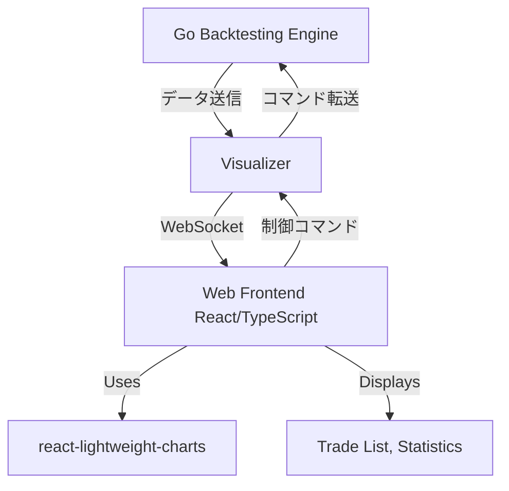

# FX バックテストライブラリ 拡張設計書: ビジュアルモード

## 1. 概要

既存の FX バックテストライブラリにビジュアルモードを追加し、バックテストの実行状況をリアルタイムでチャート上に可視化する機能を提供する。MT5 のストラテジーテスターのようなユーザー体験を目指し、取引履歴、ポジション、損益などを直感的に把握できるようにする。

## 2. 要件

- バックテストの進行に合わせて、ローソク足チャートをリアルタイムで更新する。
- チャート上に取引（エントリー、エグジット）ポイント、ポジションの損益状況を表示する。
- バックテストの実行速度を調整できる機能（例: スライダーで速度変更）。
- バックテストの一時停止、再開、スキップ機能。
- 主要な統計情報（残高、総損益など）をリアルタイムで表示する。
- 使用するチャートライブラリ: `lightweight-charts`

## 3. アーキテクチャ

### 3.1 全体構成

Go 言語で実装されたバックテストエンジンと、React/TypeScript で実装された Web ベースのフロントエンドを組み合わせる。両者間の通信には WebSocket を使用し、リアルタイム性の高いデータ転送を実現する。

**Visualizer コンポーネント**を中間層として設計し、バックテストエンジンとフロントエンドの疎結合を実現する。



### 3.2 コアコンポーネント

#### 3.2.1 Go Backtesting Engine (Backend)

既存の`backtester`パッケージを拡張し、**Visualizer**コンポーネントと連携する。

- **`backtester.Backtester`の拡張**:
  - Visualizer への通知機能を追加し、バックテストの各ステップで状態変化を送信する。
  - 現在のチャートデータ（ローソク足）と取引イベント（新規注文、ポジション更新、決済など）を構造化して提供する。
  - Visualizer からの制御コマンド（一時停止、再開、速度変更など）を受信し、バックテストの実行を制御する。
- **データ構造の定義**: Visualizer に送信するデータ（ローソク足、取引イベント）の Go 構造体を定義する。

#### 3.2.2 Visualizer コンポーネント (中間層)

バックテストエンジンとフロントエンドの間の橋渡し役として新規実装する。

- **責務**:
  - バックテストエンジンからのデータを受信し、WebSocket経由でフロントエンドに転送する
  - フロントエンドからの制御コマンドを受信し、バックテストエンジンに転送する
  - データフォーマットの変換（Go構造体 ↔ JSON）
  - WebSocket接続の管理（接続、切断、再接続）
  - 複数クライアントへの同時配信サポート

- **主要機能**:
  - **WebSocket Server**: フロントエンドとの通信を管理
  - **Data Processor**: バックテストデータの変換・フィルタリング
  - **Command Handler**: フロントエンドからの制御コマンド処理
  - **Connection Manager**: 複数のWebSocket接続を管理
  - **Event Broadcaster**: リアルタイムイベントの配信

- **インターフェース**:
```go
type Visualizer interface {
    // バックテストエンジンからのデータ受信
    OnCandleUpdate(candle *models.Candle)
    OnTradeEvent(trade *models.Trade)
    OnStatisticsUpdate(stats *models.Statistics)
    
    // フロントエンドからの制御コマンド処理
    OnControlCommand(cmd *ControlCommand) error
    
    // WebSocket管理
    Start(port int) error
    Stop() error
    BroadcastMessage(message interface{}) error
}
```

#### 3.2.3 Web Frontend (React/TypeScript)

`Vite`などでプロジェクトを初期化し、以下の主要コンポーネントを実装する.

- **WebSocket Client**: Visualizer との WebSocket 接続を確立し、受信したデータを処理する。
- **Chart Component**: `react-lightweight-charts`を使用して、受信したローソク足データを表示し、取引イベントをオーバーレイで描画する。
- **Control Panel**: バックテストの実行速度調整、一時停止、再開、スキップなどの UI を提供する。
- **Statistics Display**: リアルタイムで更新される統計情報（残高、損益など）を表示する。
- **Trade List**: 発生した取引を一覧表示する。

### 3.3 データフロー

1.  **接続確立**: フロントエンドが Visualizer の WebSocket エンドポイントに接続。
2.  **バックテスト開始**: フロントエンドから Visualizer 経由でバックテストエンジンへバックテスト開始コマンドを送信。
3.  **データストリーム**:
    - バックテストエンジンは`bt.Forward()`が実行されるたびに、現在のローソク足データと、そのステップで発生した取引イベント（もしあれば）を Visualizer に送信。
    - Visualizer はこれを JSON 形式に変換し、WebSocket 経由でフロントエンドにブロードキャスト。
    - フロントエンドはこれを受信し、チャートと UI を更新。
4.  **制御コマンド**: フロントエンドの UI 操作に応じて、一時停止、再開、速度変更などのコマンドを WebSocket 経由で Visualizer に送信。Visualizer はこれをバックテストエンジンに転送。

### 3.4 技術スタック

- **Backend**: Go
  - `net/http` (WebSocket サーバー)
  - `encoding/json`
- **Frontend**: React, TypeScript
  - `react-lightweight-charts` (Charting Library)
  - `WebSocket API` (Browser built-in)
  - State Management (Jotai)
  - UI Framework (styled-components)

## 4. 実装計画

各フェーズは、t-wada 式の TDD（テスト駆動開発）サイクル（Red-Green-Refactor）を厳密に適用して進めます。

### Phase 1: Visualizer コンポーネントの実装と基本通信 (1-2 週間)

このフェーズでは、Visualizer コンポーネントを実装し、基本的な通信インフラを構築します。各タスクは TDD に沿って進めます。

1.  **Visualizer コンポーネント**:
    - Visualizer インターフェースの実装とWebSocket サーバーのセットアップ。
    - バックテストエンジンからのデータ受信機能を実装。
    - フロントエンドからの簡単な Ping/Pong メッセージに応答するハンドラを実装。
    - データフォーマット変換機能（Go構造体 → JSON）の実装。
2.  **Go Backend**:
    - `backtester.Backtester`に Visualizer への通知機能を追加。
    - 現在のローソク足とダミーの取引イベントを Visualizer に送信する機能を実装。
3.  **React Frontend**:
    - 基本的な React プロジェクトのセットアップ (`Vite` with TypeScript)。
    - WebSocket クライアントの実装と Visualizer への接続。
    - 受信したローソク足データをコンソールに表示する。
    - `react-lightweight-charts`を導入し、受信したローソク足データでチャートを初期表示。

### Phase 2: リアルタイムチャートと取引イベントの可視化 (2-3 週間)

このフェーズでは、チャート上でのリアルタイムなデータ表示と取引イベントの可視化を実現します。各タスクは TDD に沿って進めます。

1.  **Visualizer コンポーネント**:
    - 取引イベントのデータ処理とフィルタリング機能を実装。
    - 複数クライアント向けの効率的なデータ配信機能を実装。
    - イベントの優先度管理とバッファリング機能を追加。
2.  **Go Backend**:
    - `backtester.Backtester`から、実際のローソク足データと、`Broker`から取得した実際の取引イベント（`models.Trade`）を Visualizer に送信するロジックを実装。
    - 取引イベント（エントリー、エグジット）を識別するためのデータ構造を定義し、Visualizer に通知。
3.  **React Frontend**:
    - `react-lightweight-charts`を使用して、リアルタイムでローソク足チャートを更新。
    - 受信した取引イベントをチャート上にマーカーとして表示する機能（例: 買いは緑の矢印、売りは赤の矢印）。
    - ポジションの現在損益をチャート上にラインやテキストで表示する（オプション）。

### Phase 3: 制御機能と統計情報の表示 (1-2 週間)

このフェーズでは、バックテストの制御機能とリアルタイム統計情報の表示を実装します。各タスクは TDD に沿って進めます。

1.  **Visualizer コンポーネント**:
    - フロントエンドからの制御コマンドを受信し、バックテストエンジンに転送するCommand Handlerを実装。
    - 統計情報の集計とフォーマット機能を実装。
    - 制御コマンドのバリデーションとエラーハンドリング機能を追加。
2.  **Go Backend**:
    - Visualizer からの「一時停止」「再開」「速度変更」コマンドを受信し、バックテストの実行を制御するロジックを実装。
    - バックテストの各ステップで、現在の残高、総損益などの統計情報を Visualizer に送信。
3.  **React Frontend**:
    - バックテストの実行を制御するための UI（ボタン、スライダー）を実装。
    - 受信した統計情報をリアルタイムで表示する UI コンポーネントを実装。
    - 取引履歴を一覧表示するテーブルコンポーネントを実装。

### Phase 4: パフォーマンス最適化と UX 改善 (1 週間)

このフェーズでは、システム全体のパフォーマンス最適化とユーザーエクスペリエンスの向上を図ります。各タスクは TDD に沿って進めます。

1.  **Visualizer コンポーネント**:
    - 大量のデータ送信時のパフォーマンス最適化（例: バッチ処理、差分更新、データ圧縮）。
    - 接続管理の最適化（接続プール、自動再接続、ハートビート）。
    - メモリ使用量の最適化とリソース管理。
2.  **Go Backend**:
    - Visualizer との通信効率の向上（非同期処理、バッファリング）。
    - エラーハンドリングとロギングの強化。
3.  **React Frontend**:
    - UI/UX の改善（ローディング表示、エラーメッセージ、レスポンシブデザイン）。
    - チャートのズーム、スクロール、期間選択などのインタラクティブ機能の強化。

## 5. 考慮事項

- **データ同期**: バックエンドとフロントエンド間のデータ同期の正確性。特に、バックテストの速度変更や一時停止時のチャート表示の整合性。
- **パフォーマンス**: 大量のヒストリカルデータを扱うため、WebSocket 通信の効率とフロントエンドのレンダリングパフォーマンスが重要。
- **エラーハンドリング**: 通信エラー、データ解析エラーなど、堅牢なエラーハンドリングが必要。
- **セキュリティ**: WebSocket 通信のセキュリティ（本番環境での HTTPS/WSS の利用など）。
- **デプロイ**: Go バックエンドと React フロントエンドをどのようにデプロイするか。

## 6. 今後の展望

- 複数のバックテスト結果の比較機能。
- カスタムインジケーターの追加機能。
- バックテスト結果のエクスポート機能（画像、CSV など）。
- より高度な UI/UX デザイン。
