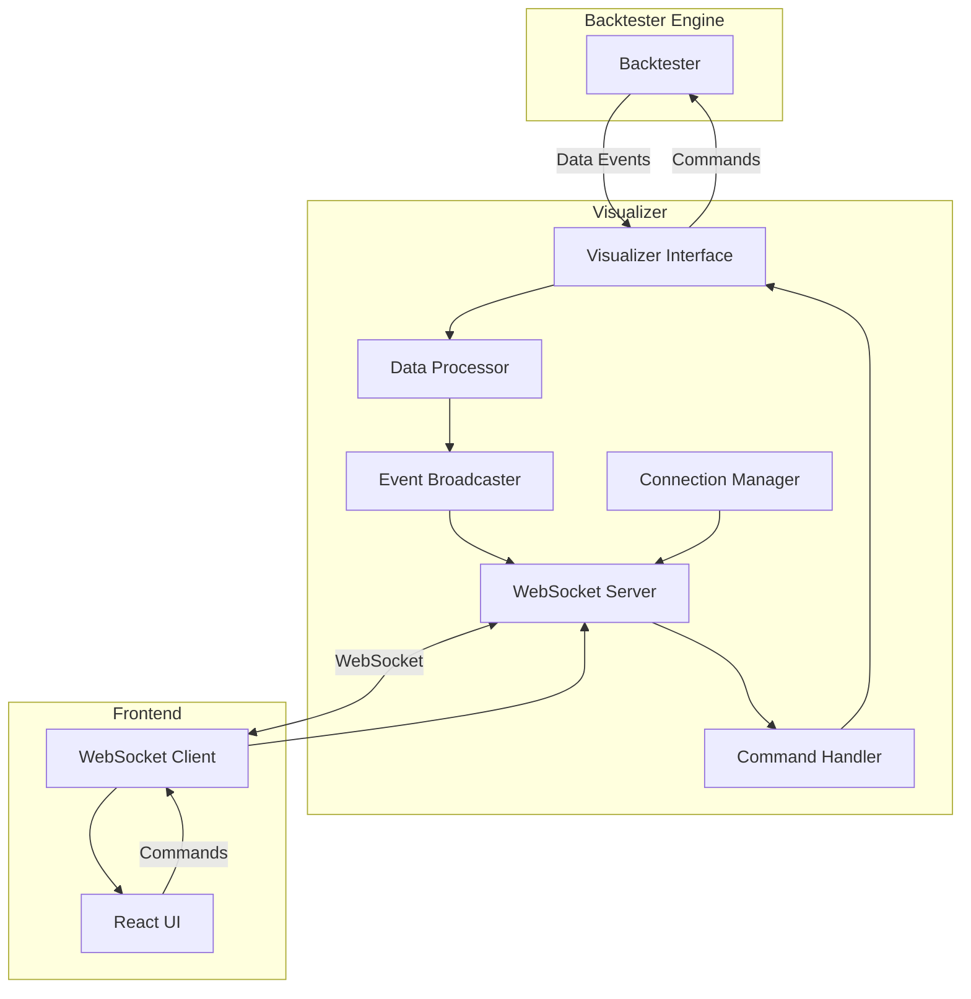

# Visualizer コンポーネント設計書

## 1. 概要

Visualizer コンポーネントは、FXバックテストエンジンとWebフロントエンド間の橋渡し役として機能する中間層コンポーネントです。バックテストの実行データをリアルタイムで可視化するための通信基盤とデータ変換機能を提供します。

## 2. 設計原則

### 2.1 責務の分離
- **単一責任の原則**: 通信とデータ変換のみに特化
- **疎結合**: バックテストエンジンとフロントエンドの独立性を保持
- **拡張性**: 新しいデータ型や通信プロトコルの追加が容易

### 2.2 信頼性
- **エラーハンドリング**: 通信障害やデータ変換エラーの適切な処理
- **復旧機能**: 自動再接続とデータ同期の復元
- **ログ機能**: 詳細なデバッグ情報の記録

## 3. アーキテクチャ

### 3.1 全体構成



### 3.2 コンポーネント詳細

#### 3.2.1 Visualizer Interface
バックテストエンジンとの主要なインターフェース

```go
type Visualizer interface {
    // ライフサイクル管理
    Start(port int) error
    Stop() error
    IsRunning() bool
    
    // バックテストエンジンからのイベント受信
    OnCandleUpdate(candle *models.Candle) error
    OnTradeEvent(trade *models.Trade) error
    OnPositionUpdate(position *models.Position) error
    OnStatisticsUpdate(stats *models.Statistics) error
    OnBacktestStateChange(state BacktestState) error
    
    // フロントエンドからのコマンド処理
    OnControlCommand(cmd *ControlCommand) error
    
    // 接続管理
    GetConnectionCount() int
    BroadcastMessage(message interface{}) error
    
    // 設定
    SetConfig(config *VisualizerConfig) error
    GetConfig() *VisualizerConfig
}
```

#### 3.2.2 WebSocket Server
フロントエンドとの通信を管理

```go
type WebSocketServer struct {
    server   *http.Server
    upgrader websocket.Upgrader
    clients  map[string]*WebSocketClient
    hub      *ConnectionHub
    config   *ServerConfig
}

type WebSocketClient struct {
    id       string
    conn     *websocket.Conn
    send     chan []byte
    hub      *ConnectionHub
    lastPing time.Time
}
```

#### 3.2.3 Data Processor
データ変換とフォーマット処理

```go
type DataProcessor struct {
    formatters map[string]DataFormatter
    filters    []DataFilter
    cache      *DataCache
}

type DataFormatter interface {
    Format(data interface{}) ([]byte, error)
    GetType() string
}

type DataFilter interface {
    Filter(data interface{}) (interface{}, error)
    ShouldProcess(data interface{}) bool
}
```

#### 3.2.4 Command Handler
フロントエンドからのコマンド処理

```go
type CommandHandler struct {
    handlers map[string]CommandProcessor
    validator *CommandValidator
}

type CommandProcessor interface {
    Process(cmd *ControlCommand) error
    GetCommandType() string
}

type ControlCommand struct {
    Type      string                 `json:"type"`
    Data      map[string]interface{} `json:"data"`
    ClientID  string                 `json:"client_id"`
    Timestamp time.Time              `json:"timestamp"`
}
```

#### 3.2.5 Connection Manager
WebSocket接続の管理

```go
type ConnectionManager struct {
    connections map[string]*Connection
    maxClients  int
    heartbeat   time.Duration
    timeout     time.Duration
}

type Connection struct {
    id           string
    conn         *websocket.Conn
    isActive     bool
    lastActivity time.Time
    subscriptions []string
}
```

#### 3.2.6 Event Broadcaster
イベントの効率的な配信

```go
type EventBroadcaster struct {
    channels map[string]chan []byte
    buffer   *CircularBuffer
    batchSize int
    flushInterval time.Duration
}

type CircularBuffer struct {
    data     [][]byte
    head     int
    tail     int
    size     int
    capacity int
}
```

## 4. データ構造

### 4.1 メッセージフォーマット

#### 4.1.1 基本メッセージ構造
```go
type Message struct {
    Type      string      `json:"type"`
    Data      interface{} `json:"data"`
    Timestamp time.Time   `json:"timestamp"`
    ClientID  string      `json:"client_id,omitempty"`
}
```

#### 4.1.2 イベントタイプ
```go
const (
    // データ更新イベント
    EventCandleUpdate    = "candle_update"
    EventTradeEvent      = "trade_event"
    EventPositionUpdate  = "position_update"
    EventStatisticsUpdate = "statistics_update"
    EventBacktestState   = "backtest_state"
    
    // 制御コマンド
    CommandPlay         = "play"
    CommandPause        = "pause"
    CommandStop         = "stop"
    CommandSpeedChange  = "speed_change"
    CommandReset        = "reset"
    
    // システムメッセージ
    SystemPing          = "ping"
    SystemPong          = "pong"
    SystemError         = "error"
    SystemConnected     = "connected"
    SystemDisconnected  = "disconnected"
)
```

### 4.2 設定構造

```go
type VisualizerConfig struct {
    // サーバー設定
    Port            int           `json:"port"`
    ReadTimeout     time.Duration `json:"read_timeout"`
    WriteTimeout    time.Duration `json:"write_timeout"`
    MaxClients      int           `json:"max_clients"`
    
    // データ処理設定
    BufferSize      int           `json:"buffer_size"`
    BatchSize       int           `json:"batch_size"`
    FlushInterval   time.Duration `json:"flush_interval"`
    
    // 接続管理設定
    HeartbeatInterval time.Duration `json:"heartbeat_interval"`
    ClientTimeout     time.Duration `json:"client_timeout"`
    
    // ログ設定
    LogLevel        string        `json:"log_level"`
    LogFile         string        `json:"log_file"`
    EnableMetrics   bool          `json:"enable_metrics"`
}
```

## 5. 実装詳細

### 5.1 初期化フロー

```go
func NewVisualizer(config *VisualizerConfig) (*Visualizer, error) {
    v := &Visualizer{
        config:          config,
        server:          NewWebSocketServer(config),
        processor:       NewDataProcessor(config),
        commandHandler:  NewCommandHandler(),
        connectionMgr:   NewConnectionManager(config),
        broadcaster:     NewEventBroadcaster(config),
        isRunning:       false,
    }
    
    // コンポーネント間の依存関係を設定
    v.server.SetMessageHandler(v.handleMessage)
    v.server.SetConnectionHandler(v.handleConnection)
    v.commandHandler.SetBacktestController(v.backtestController)
    
    return v, nil
}
```

### 5.2 データ処理フロー

```go
func (v *Visualizer) OnCandleUpdate(candle *models.Candle) error {
    // 1. データ検証
    if err := v.validateCandle(candle); err != nil {
        return fmt.Errorf("invalid candle data: %w", err)
    }
    
    // 2. データ変換
    message, err := v.processor.ProcessCandleData(candle)
    if err != nil {
        return fmt.Errorf("failed to process candle data: %w", err)
    }
    
    // 3. ブロードキャスト
    if err := v.broadcaster.Broadcast(message); err != nil {
        return fmt.Errorf("failed to broadcast candle update: %w", err)
    }
    
    return nil
}
```

### 5.3 コマンド処理フロー

```go
func (v *Visualizer) handleMessage(clientID string, data []byte) error {
    var cmd ControlCommand
    if err := json.Unmarshal(data, &cmd); err != nil {
        return fmt.Errorf("failed to unmarshal command: %w", err)
    }
    
    cmd.ClientID = clientID
    cmd.Timestamp = time.Now()
    
    // コマンド検証
    if err := v.commandHandler.Validate(&cmd); err != nil {
        return fmt.Errorf("invalid command: %w", err)
    }
    
    // コマンド処理
    return v.commandHandler.Process(&cmd)
}
```

## 6. エラーハンドリング

### 6.1 エラー分類

```go
type ErrorType int

const (
    ErrorTypeConnection ErrorType = iota
    ErrorTypeData
    ErrorTypeCommand
    ErrorTypeSystem
)

type VisualizerError struct {
    Type      ErrorType
    Message   string
    Cause     error
    Timestamp time.Time
    ClientID  string
}
```

### 6.2 エラー処理戦略

- **接続エラー**: 自動再接続と状態復旧
- **データエラー**: データ検証とフォールバック
- **コマンドエラー**: エラーレスポンスとロギング
- **システムエラー**: 緊急停止と復旧

## 7. パフォーマンス最適化

### 7.1 データ圧縮
```go
type DataCompressor interface {
    Compress(data []byte) ([]byte, error)
    Decompress(data []byte) ([]byte, error)
}
```

### 7.2 バッチ処理
```go
type BatchProcessor struct {
    batchSize     int
    flushInterval time.Duration
    buffer        []Message
    ticker        *time.Ticker
}
```

### 7.3 接続プール
```go
type ConnectionPool struct {
    pool     sync.Pool
    maxSize  int
    active   int
    idle     int
}
```

## 8. セキュリティ

### 8.1 認証・認可
```go
type Authenticator interface {
    Authenticate(token string) (*User, error)
    Authorize(user *User, action string) error
}
```

### 8.2 入力検証
```go
type InputValidator struct {
    schemas map[string]*jsonschema.Schema
}
```

## 9. 監視・メトリクス

### 9.1 メトリクス収集
```go
type Metrics struct {
    ConnectionCount    int64
    MessagesSent       int64
    MessagesReceived   int64
    Errors             int64
    AverageLatency     time.Duration
    DataThroughput     int64
}
```

### 9.2 ヘルスチェック
```go
type HealthChecker struct {
    checks []HealthCheck
}

type HealthCheck interface {
    Check() error
    GetName() string
}
```

## 10. テスト戦略

### 10.1 単体テスト
- 各コンポーネントの独立したテスト
- モックオブジェクトを使用した依存関係の分離
- エラーケースの網羅的なテスト

### 10.2 統合テスト
- WebSocket通信のエンドツーエンドテスト
- データ変換の正確性テスト
- 複数クライアント接続のテスト

### 10.3 パフォーマンステスト
- 大量データ処理の負荷テスト
- 同時接続数のスケーラビリティテスト
- メモリ使用量の監視

## 11. デプロイメント

### 11.1 設定管理
```go
type ConfigManager struct {
    env    string
    config *VisualizerConfig
}
```

### 11.2 ログ設定
```go
type LogConfig struct {
    Level      string
    Format     string
    Output     string
    Rotation   bool
    MaxSize    int
    MaxBackups int
}
```

## 12. 今後の拡張

### 12.1 プロトコル拡張
- gRPC対応
- HTTP/2 Server-Sent Events
- WebRTC データチャンネル

### 12.2 機能拡張
- データ永続化
- 分散処理対応
- マルチテナント機能

### 12.3 監視・運用
- Prometheus メトリクス
- 分散トレーシング
- 自動スケーリング

## 13. 参考資料

- [WebSocket RFC 6455](https://tools.ietf.org/html/rfc6455)
- [Go WebSocket Package](https://pkg.go.dev/github.com/gorilla/websocket)
- [JSON Schema](https://json-schema.org/)
- [Prometheus Metrics](https://prometheus.io/docs/concepts/metric_types/)